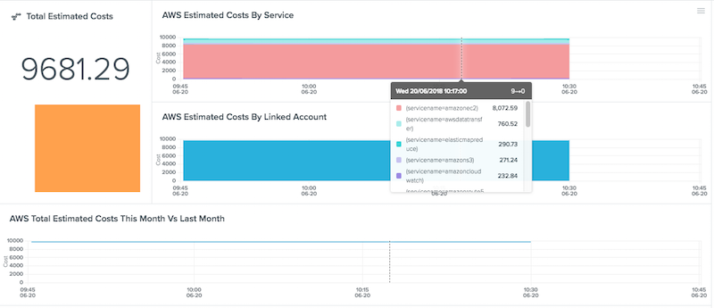

AWS Billing Integration
=======================

== Description ==

This integration pulls your estimated billing costs from AWS Cloudwatch so you can easily keep an eye on your
AWS costs for each service and linked account from within Outlyer.

== Metrics Collected ==

| Metric Name                 |Type |Labels                              |Unit |Description                                                            |
|-----------------------------|-----|------------------------------------|-----|-----------------------------------------------------------------------|
|aws.billing_estimated_charges|Gauge|servicename, currency, linkedaccount|Count|Total estimated charges per service/account for current billing period.|

== Installation ==

To get started please ensure that your billing preferences have been updated to send billing metrics to
Cloudwatch so these metrics can be queried with this integration. You can do this easily from the
[AWS Billing Preferences Page](https://console.aws.amazon.com/billing/home?region=us-east-1#/preference)
(ensure you have permissions to access this page) and enabling the `Enable Billing Alerts` checkbox.

In order for this integration to run, you must create an IAM role and access keys for the plugin
to connect to your AWS Cloudwatch metrics:

1. To get started, open the AWS Management Console
2. Click the IAM tab.
3. Click the Create a New Group of Users button.
4. Enter a Group Name called Outlyer.
5. Select the Read Only Access Policy Template then click Continue.
6. Click the Create New Users tab.
7. Enter a new User Name called Outlyer and click Continue and then Finish.
8. Click Show User Security Credentials.
9. Copy and paste your Access Key Id and the Secret Access Key somewhere safe.

The plugin must set the following variables to run:

* `AWS_ACCESS_KEY_ID`: The AWS Access Key copied above
* `AWS_SECRET_ACCESS_KEY`: The AWS Secret Key copied above

In addition the following variables can be set to override the default values:

* `time_range`: The time range in hours to query your metrics over. By default this is set to the last
24 hours as estimated costs are posted once every day.

== Changelog ==

|Version|Release Date|Description                                    |
|-------|------------|-----------------------------------------------|
|1.0    |24-May-2018 |Initial version of our AWS billing integration.|
