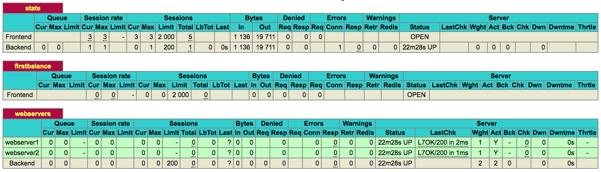

HAProxy Integration
===================

== Description ==

HAProxy is a free, very fast and reliable solution offering high availability, load balancing, and proxying for TCP and HTTP-based applications.

This integration will monitor your HAProxy instance by collecting metrics from either HAProxy UNIX socket or HTTP stats page.

Once enabled you will get a default HAProxy dashboard to help you get started monitoring your key HAProxy metrics.

== Metrics Collected ==

|Metric Name     |Type   |Labels        |Unit           |Description                                                                          |
|----------------|-------|--------------|---------------|-------------------------------------------------------------------------------------|
|haproxy.bin     |Counter|pxname, svname|byte/second    |Rate of bytes received by the frontend per second.                                   |
|haproxy.bout    |Counter|pxname, svname|byte/second    |Rate of bytes sent by the frontend per second.                                       |
|haproxy.dreq    |Counter|pxname, svname|request/second |Rate of requests denied due to security concerns (ACL-restricted).                   |
|haproxy.dresp   |Counter|pxname, svname|response/second|Rate of responses denied due to security concerns (ACL-restricted).                  |
|haproxy.ereq    |Counter|pxname, svname|error/second   |Rate of request errors.                                                              |
|haproxy.hrsp_4xx|Counter|pxname, svname|response/second|Rate of HTTP client errors.                                                          |
|haproxy.hrsp_5xx|Counter|pxname, svname|response/second|Rate of HTTP server errors.                                                          |
|haproxy.scur    |Gauge  |pxname, svname|session        |Current number of active sessions.                                                   |
|haproxy.status  |Gauge  |pxname, svname|               |Current backend status (0 = UP, 1 = DOWN).                                           |
|haproxy.rate    |Gauge  |pxname, svname|session/second |Number of sessions created per second.                                               |
|haproxy.req_rate|Gauge  |pxname, svname|request/second |HTTP requests per second.                                                            |
|haproxy.econ    |Counter|pxname, svname|error/second   |Rate of requests that encountered an error attempting to connect to a backend server.|
|haproxy.eresp   |Counter|pxname, svname|error/second   |Rate of requests whose responses yielded an error.                                   |
|haproxy.wretr   |Counter|pxname, svname|retry/second   |Rate of times a connection was retried.                                              |
|haproxy.wredis  |Counter|pxname, svname|error/second   |Rate of times a request was redispatched to a different backend.                     |
|haproxy.qcur    |Gauge  |pxname, svname|request        |Current number of requests unassigned in queue.                                      |
|haproxy.qtime   |Gauge  |pxname, svname|millisecond    |Average queue time over the last 1024 requests.                                      |
|haproxy.rtime   |Gauge  |pxname, svname|millisecond    |Average response time over the last 1024 requests (0 for TCP).                       |

== Installation ==

HAProxy provides two means by which you can monitor its performance: via an HTTP status page, or via sockets. By default, this plugin collects metrics via UNIX socket, but it can be easily customized to collect metrics over HTTP by using environment variables.

In order to enable HAProxy metrics collection via HTTP status page or sockets, follow the instructions described below.

#### Enable HAProxy UNIX Socket

Edit the main HAProxy configuration file (usually located at `/etc/haproxy/haproxy.cfg`) and paste the two following `stats` instructions inside the `global` block:

```
global
    ...
    stats socket /var/run/haproxy.sock mode 600 level admin
    stats timeout 2m
```

Restart your HAProxy instance and run this plugin against your HAProxy instance to start collecting metrics.

#### Enable HTTP Status Page

Edit the main HAProxy configuration file (usually located at `/etc/haproxy/haproxy.cfg`) and define a new `listen` block as follows:

```
listen stats
  bind :9000
  mode http
  stats enable
  stats hide-version
  stats realm Haproxy\ Statistics
  stats uri /haproxy_stats
  stats auth outlyer:<YOUR_PASSWORD>
```

Replace `<YOUR_PASSWORD>` with a safe password. Note that in the above configuration, the defined `username` is **outlyer**. 

Restart your HAProxy instance and navigate to `http://<haproxy-host>:9000/haproxy_stats`. You should be able to see the HAProxy status page:



Run this plugin with the environment variables `mode: http`, `url: http://<haproxy-host>:9000/haproxy_stats`, `username: outlyer`, and `password: <YOUR_PASSWORD>` set against your HAProxy instance to start collecting metrics.

### Plugin Environment Variables

The HAProxy plugin can be customized via environment variables.

|Variable    |Default              |Description                                                        |
|------------|---------------------|-------------------------------------------------------------------|
|mode        |socket               |The metric collection mode. Possible values are `socket` or `http`.|
|haproxy_sock|/var/run/haproxy.sock|The path to the HAProxy UNIX socket (mode: socket).                |
|url         |                     |The URL to HAProxy status page (mode: http).                       |
|username    |                     |The username to connect to HAProxy status page (mode: http).       |
|password    |                     |The password to connect to HAProxy status page (mode: http).       |

== Changelog ==

|Version|Release Date|Description                                           |
|-------|------------|------------------------------------------------------|
|1.0    |22-Jun-2018 |Initial version of our HAProxy monitoring integration.|
